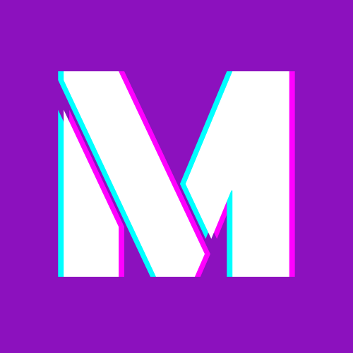

# Projeto - MyWallet-backend

  

  

## Objective

   The project MyWallet was developed throughout the Bootcamp of "Respode Aí". This project its a full stack aplication and has the object to register, log in and check his MyWallet account balance and show transaction history.

### Features
- [x] POST '/api/users/sign-up' 
- [x] DELETE '/api/users/log-out' 
- [x] POST '/api/users/sign-in' 
- [x] GET '/api/account' 
- [x] PUT '/api/account/update-balance' 
- [x] GET '/api/account/transaction-history/:userId' 
- [x] 'Automated testing' 
- [x] 'Middleware' 
- [x] Database Postgre 

### Tech Stack
Languages: 

     
     

The following tools and frameworks were used in the construction of the project:  
    
    
    
    

### Authors
---
Gabriel Pedro Braga Piazza.

Piazza Medias:

 

 
Made by, Get in Touch!  
